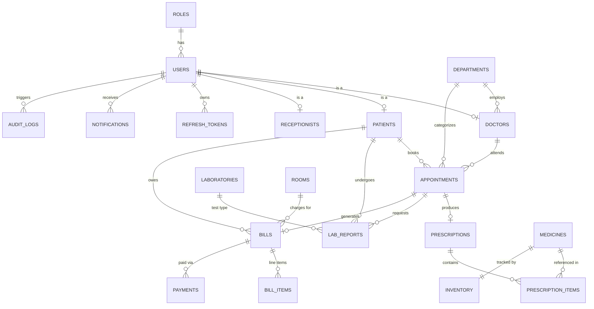

# Entity-Relationship Diagram

## Relationship Notes

- `users` is the single authentication table for every role; `doctors`,
  `patients`, and `receptionists` are 1:1 extension tables holding
  role-specific attributes. This avoids duplicating auth/security columns
  per role and keeps `Spring Security`'s `UserDetailsService` simple.
- `appointments` is the central transactional entity — it links a patient,
  a doctor, and a department, and fans out to `prescriptions`, `lab_reports`,
  and `bills`.
- `inventory` is kept separate from `medicines` (1:1) so stock levels can be
  updated frequently without touching the more static medicine catalog.
- `bills` aggregates `bill_items` (consultation fees, medicine charges, lab
  fees, room charges) and can have multiple `payments` (e.g. partial payment
  followed by balance settlement).
- `audit_logs` and `notifications` are cross-cutting tables referenced by
  `user_id` for traceability and in-app alerts.

See `V1__init_schema.sql` in `backend/src/main/resources/db/migration/` for the
authoritative, executable schema.
