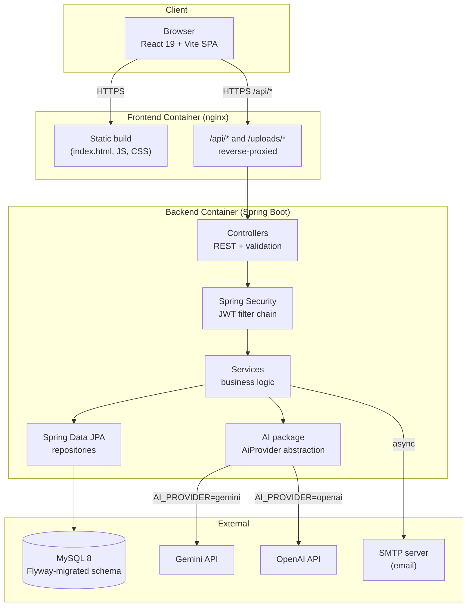
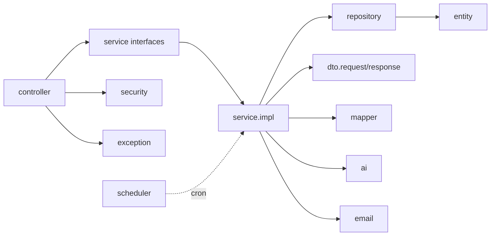
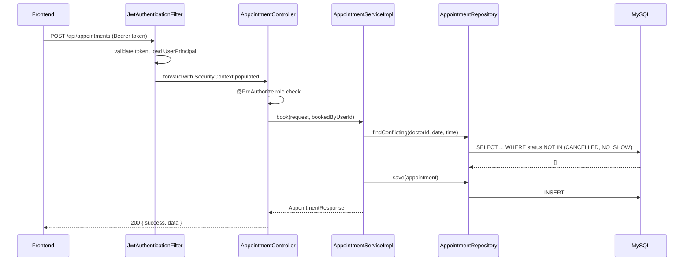
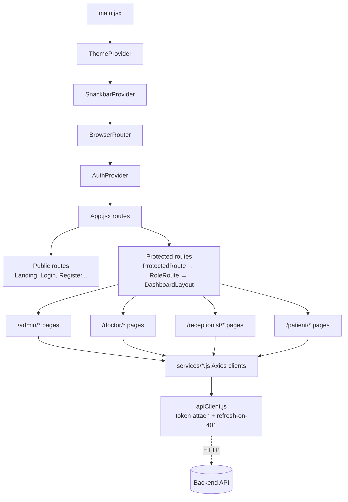

# Project Architecture

## System Overview

## Backend: Clean-Architecture Layering

Each package has exactly one job:

| Package | Responsibility |
|---|---|
| `controller` | HTTP boundary — request mapping, `@PreAuthorize` role checks, delegates to services |
| `service` / `service.impl` | Business logic, transactions (`@Transactional`), the only layer allowed to orchestrate multiple repositories |
| `repository` | Spring Data JPA interfaces — no business logic, just queries |
| `entity` | JPA-mapped domain objects, 1:1 with the database schema |
| `dto.request` / `dto.response` | The API's actual contract — entities never leave the service layer directly |
| `security` | JWT issuance/validation, `UserDetailsService`, filter chain |
| `ai` | The `AiProvider` abstraction — `GeminiAiProvider` / `OpenAiAiProvider`, swappable via config |
| `email` | Async transactional email (verification, reset, appointment notifications) |
| `exception` | Custom exceptions + `GlobalExceptionHandler` — every error becomes a consistent JSON shape |
| `config` | `SecurityConfig`, `OpenApiConfig`, `AiConfig`, `WebMvcConfig` — framework wiring, no business logic |

## Request Lifecycle (authenticated write, e.g. booking an appointment)

## Frontend: Component & State Architecture

`apiClient.js` is the single chokepoint every service file goes through — it attaches the access
token to every request and, on a 401, transparently refreshes and retries (queueing concurrent
requests during the refresh so a burst of calls doesn't trigger a burst of token refreshes). No page
component talks to Axios directly.

## Database Schema

See `database/ER_DIAGRAM.md` for the full entity-relationship diagram and design notes, and
`backend/src/main/resources/db/migration/V1__init_schema.sql` for the authoritative, executable schema.

## Folder Structure

See the root `README.md`'s Folder Structure section for the annotated directory tree.
